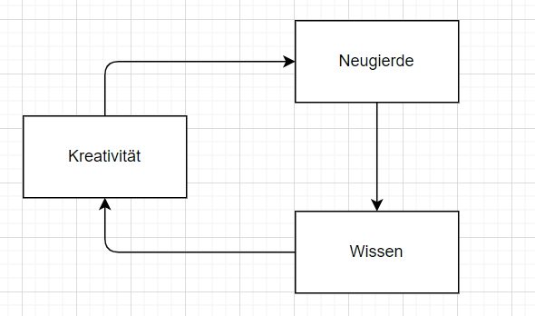

# Kreativitätstechniken
## Was ist Kreativität
**Kreativität** ist die Fähigkeit, etwas zu erschaffen, was neu oder originell und dabei nützlich oder brauchbar ist. Darüber hinaus gibt es verschiedene Ansätze, was Kreativität im Einzelnen auszeichnet und wie sie entsteht. (Wikipedia, 14.01.2022, https://de.wikipedia.org/wiki/Kreativit%C3%A4t)
Durch diese einfache Definition ist bereits zu erkennen, dass **Kreativität** eine Fähigkeit ist und demnach in allen Menschen vorhanden ist, der Unterschied ist hierbei nur die Ausprägung.
Zur Ausprägung lässt sich generell diese an einem einfachen Schaubild erklären, denn meist wird hinterfragt, wie man kreativer wird.

Anhand dieses Bildes ist sehr einfach zu erkennen wir der ewige Kreislauf der **Kreativität** funktioniert. Denn wenn man selbst jeden Abend nachhause kommt, so wird sich das Zuhause nicht ändern, sondern nur man selbst, da einem kreative Eindrücke entgegengekommen sind.

## Techniken um kreativer zu werden

### Entspannung
Durch körperliche **Entspannung** wird es dem Gehirn oft erst möglich Gedanken kreisen zu lassen und diese zu durchdenken und dementsprechen selbst kreativ zu werden. Oft entstehen in diesen entspannten Phasen sogenannte "Geistesblitze", Ideen die so nicht einfach gekommen wären aber für sich selbst in diesem Moment durch die innere Ruhe entstanden sind.
Selbst Albert Einstein sagt bereits: "Kreativität ist das Überbleibsel verschwendeter Zeit." 
### Bündelung von Kreativität
Wenn über zu viele Dinge gleichzeitig nachgedacht wird, so kann man sich selbst auch in Gedanken verlieren. Hierbei helfen Methoden zur Ordnung der Gedanken.
Eine sehr bekannte und beliebte Methode ist die "*Mindstorming*"-Methode, bei dieser wird ein Überthema bestimmt und zu diesem alle Gedanken zu Unterthemen, welche in irgendeiner Weise dazugehören, heruntergeschrieben. Dannach wird die ganze *Mindmap* betrachtet und Themen können gruppiert und zusammengefasst werden.
Diese Methode funktioniert vorallem dann sehr effizient, wenn mehrere Personen an einer *Mindmap* arbeiten, da externe Gedankenanstöße vorhanden sind und somit die eigene **Kreativität** fördern.
## Intelligenz, Kreativität, Wissen
Generell ist hier zu sagen, dass *Intelligenz* mit **Kreativität** korrelieren kann, da diese beide Faktoren sich gegenseitig beeinflussen können, jedoch nicht müssen.
Hier muss grundliegend zwischen den verschiedenen hier definierten Eigenschaften Unterschieden werden, da *Intelligenz* zwar wie **Kreativität** eine Fähigkeit ist, jedoch nicht die gleiche. Eine sehr kreative Person kann bspw. weniger intelligent sein oder die eigenen kreativen Ideen umsetzen können, sie jedoch selber haben und dennoch anderen Personen vorschlagen.

*Intelligenz* ist auch nicht gleichzusetzen mit *Wissen*, da dies zwei fundamental unterschiedliche Eigenschaften sind. Wie bereits angesprochen ist *Intelligenz* eine Fähigkeit, die dazu befähigt *Wissen* schneller / effektiver aufzunehmen, abzuspeichern und zu verarbeiten.
Hierdurch wird nochmals aufgezeigt das eine höhere *Intelligenz* hilft mehr *Wissen* anzusammeln, welches wiederum hilft mehr **Kreativität** anzusammeln. Es ist jedoch nie auszuschließen, dass *Wissen* nicht auch mit einem niedrigeren *Intelligenzwert* aggreviert werden kann und dadurch die **Kreativität** gesteigert wird!
## Vorteile von Kreativität
**Kreativität** bietet an sich einige Vorteile, welche auch teilweise sehr greifbar und nützlich sind.
Der einfachste und größte Vorteil ist die Menge an Ideen, die eine Person hat. Denn durch diese ganzen Ideen können neue Möglichkeiten entdeckt werden oder sogar Visionen von Objekten, der Zukunft oder noch nicht greifbaren futuristischen Optionen entstehen. 
Erfinder sind die Menschen die unsere Welt vorantreiben um sie gestern so vorzubereiten wie sie heute existiert.
Ein weiterer Vorteil sind die neuen Lösungen die für Probleme entdeckt werden. Hierfür kann als sehr gutes Beispiel das Problem der Fortbewegung genannt werden. Denn nur durch die **Kreativität** und den Erfindungsreichtum der Menschen vor uns gibt es heutzutage Technologien wie Autos, Züge, Flugzeuge oder Raketen. Diese ermöglichen uns an Orte zu reisen die sonst unfassbar weit entfernt wären, wenn sonst überhaupt erreichbar.
***
## Reflektion
Zu diesem Thema ist rückblickend zu sagen, dass **Kreativität** sehr wichtig für mich selbst und mein Arbeitsumfeld ist. Denn ohne diese **Kreativität** wären Aufgaben wie Programme schreiben, Algorithmen entwerfen oder andere kreative Lösungsansätze finden sehr schwer. Ich persönlich versuche mich also dementsprechend kreativ zu halten, indem ich mich sehr oft über Sachen und Dinge informiere welche interessant für mich sind, viel Zeit für mich und meine Gedanken die in meinem Kopf kreisen nehme. Herunterschreibmethoden wie bspw. das erschaffen von Mindmaps waren mir bereits vor dem Modul bekannt finden jedoch auch in meinem persönlichen wie beruflichen Leben eine sehr große und hilfreiche Verwendung. 
Abschliesend macht es noch Sinn zu sagen, dass meiner Meinung nach jede Person kreativ sein kann, wenn sie denn nur möchte. Nicht jede Person kann in jedem Bereich kreativ sein, aber ich denke jede hat ihren eigenen kreativen Bereich, egal ob im Kochen, Zeichnen, Knobeln/Denken, Programmieren oder anderem.

[Um zur Übersicht zurückzukommen hier klicken](./README.md)
