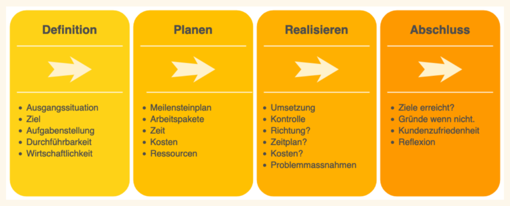

# Projektmanagement
## Was ist ein Projekt
Ein Projekt zeichnet sich durch mehrere Punkte aus. Diese müssen alle erfüllt sein, da es sich sonst hierbei nicht um ein Projekt handelt.

 1. Einmalig - Ein Projekt wird immer nur **einmalig** ausgeführt
 2. Zeitlich begrenzt - Ein Projekt hat immer **einen Anfang** und **ein Ende**
 3. Klare Zielvorgaben - Ein Projekt hat **immer ein Ziel** welches erfüllt werden soll
 4. Komplexität - Ein Projekt hat immer ein gewisses Level an **Komplexität** welches den Einsatz qualifizierter Personen erfordert
 5. Teamarbeit - Ein Projekt wird nicht alleine sondern **im Team** gelöst, meist werden hierfür auch Personen mit **unterschiedlichem Fachwissen** benötigt

## Vorgehensmethoden
### Vierphasen Modell

Das Vierphasen Modell aus den Folien von Lukas Hodel

Das Vierphasen Modell ist relativ simpel, wie der Name bereits erklärt durch 4 Phasen gekennzeichnet.
 1. Definition - Zuerst werden Definitionen für das Projekt festgelegt, welche dann als Start-/Endsituationen festgelegt werden oder Faktoren des Projektes wie die vorhandenen Ressourcen.
 2. Planen - Im nächsten Schritt werden Faktoren geplant und Ressourcen allokiert, dies sind bspw. Zeitaufwand oder Meilensteine
 3. Realisieren - Hier findet die Umsetzung des Projektes statt, abgeschlossen ist dieser Schritt normalerweise erst, sobald das Projekt beendet ist und funktionsfähig ist oder es abgebrochen wird
 4. Abschluss - Als letztes wird Kritisch der ganze Prozess betrachtet. Hierbei wird darauf geachtet, ob die Planung umsetzbar war und wenn nicht, die Frage aufgeworfen warum. Im Allgemeinen spricht man hierbei auch über eine Projektreflektion.

[Weiterführende Informationen](https://www.iww.de/bbp/archiv/projektmanagement-die-vier-schritt-technik-zum-erfolg-f24029)

### Wasserfallmodell

Genau wie das Vierphasen Modell ist das sogenannte Wasserfallmodell auch auf der simpleren Seite der Vorgangsmethoden.
Der Name des Wasserfall leitet sich von dem immer wieder auf den nächsten Schritt "fließende" Pfeil nach Abschluss eines Schritt welche im folgenden erläutert werden.

 1. Analyse - Zuerst wird eine Analyse über die vorhandenen (oder auch nicht vorhandenen) Daten getroffen. In diesem Schritt findet sich normalerweise auch die Informationsbeschaffung.
 2. Entwurf erstellen - Dies ist die Planungsphase in welcher die verschiedenen Pläne und theoretischen Vorgänge erstellt werden, welche dann in den späteren Phasen verwendet werden.
 3. Entwurf implementieren - Hierbei wird das geplante zur Theorie. Dabei werden die verschiedenenen Pläne oder der Plan umgesetzt und implementiert, jedoch noch nicht ausgeliefert.
 4. Test durchführen - In diesem Schritt wird der im voherigen implementierte Entwurf exzessiv getestet, in der Hoffnung, dass dieser die optimalste Lösung ist. Sollte dies der Fall sein wird zum nächsten Schritt übergegangen.
 5. Inbetriebnahme - Im normalerweise letzten Schritt wird der Entwurf übernommen welcher alle Tests bestanden hat. 

Je nach genauer Umsetzung dieser Vorgangsweise kann sich noch eine Reflektionsphase am Ende der Inbetriebnahme finden, welche für eine Optimierung des Prozesses sorgen kann.
In meiner persönlichen Erfahrung aus der betrieblichen Umgebung, wird diese Vorgangsweise sehr gerne genutzt, da es sich sehr einfach auf Programme anwenden lässt. Hierbei werden zum entwickelten Programm im 4. Schritt Tests geschrieben die die genaue Funktionalität überprüfen sollen, ist diese gegeben wird der Programmcode implementiert.

[Weiterführende Informationen](https://www.factro.de/blog/wasserfallmodell/)

### V-Modell

Das V-Modell ist vorallem von den dazugehörigen Tests geprägt welche dafür sorgen sollen, dass alles produzierte den Kriterien entspricht.
Hierbei wird zuerst **komplett** alles theoretisch entworfen. Der Fokus liegt darauf, alle Informationen zu sammeln und genaustens nach Plan zu implementieren.
Steht der Plan, so wird ein großer Implementierungsschritt gemacht.
Anschließend werden verschiedene Tests verwendet um die vorher genannten Spezifikation im Plan zu testen und damit nachzuschauen ob diese auch genauso wie definiert implementiert wurden.

[Weiterführende Informationen](https://projekte-leicht-gemacht.de/blog/projektmanagement/klassisch/v-modell/)

## Agile Methoden
Die vorherigen Methoden waren alle samt sehr statisch und eigenen sich nicht wirklich, sobald ein neuer externen Faktor die Planung belastet. Deswegen wurden irgendwann die sogenannten **Agilen Methoden** entwickelt welche durch immer wieder selber wiederholen bis das gewünschte Ergebnis erreicht wurde, nach denen heutzutage auch sehr oft Software entwickelt wird.
Im folgenden finden sich einige Beispiele für **Agile Methoden**.

### Spiralmodell