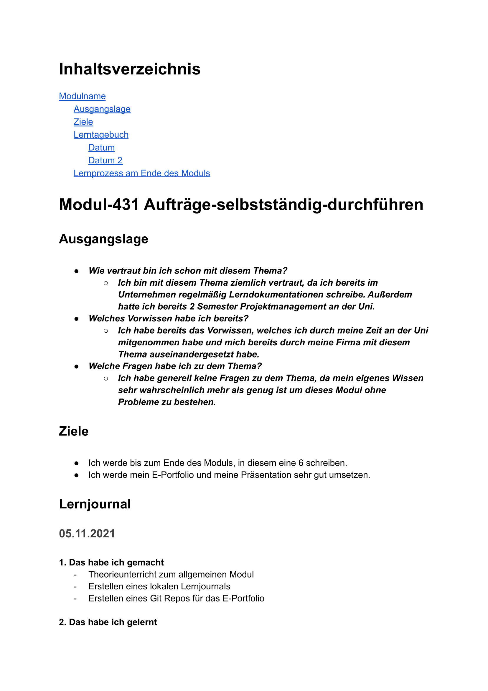
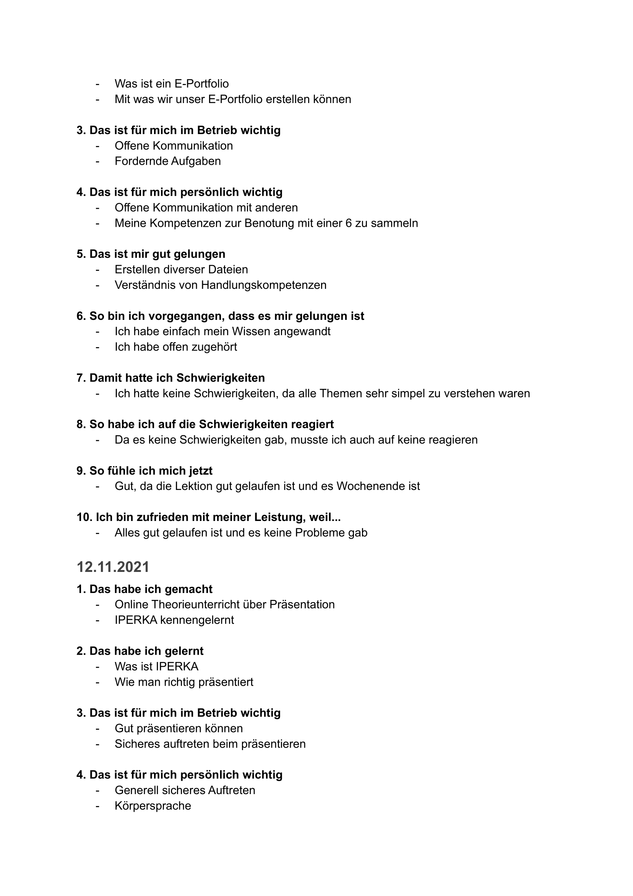
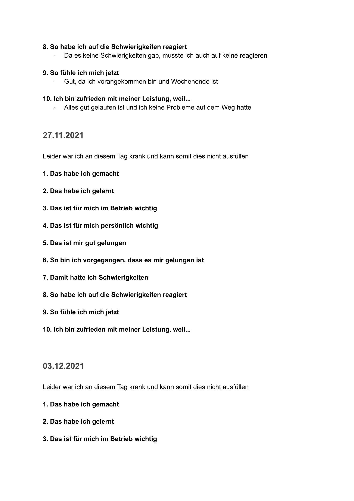
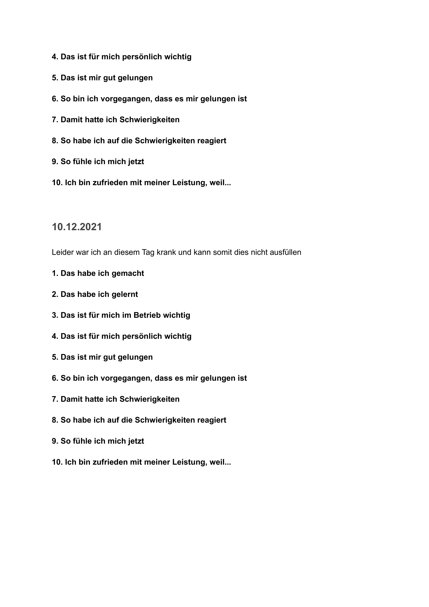
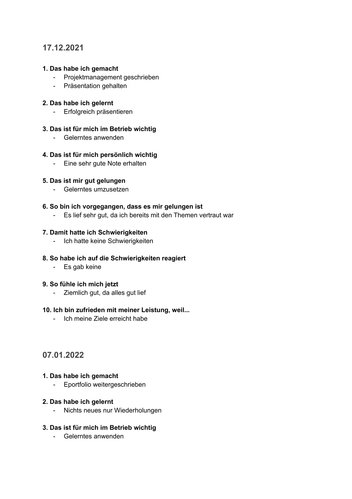
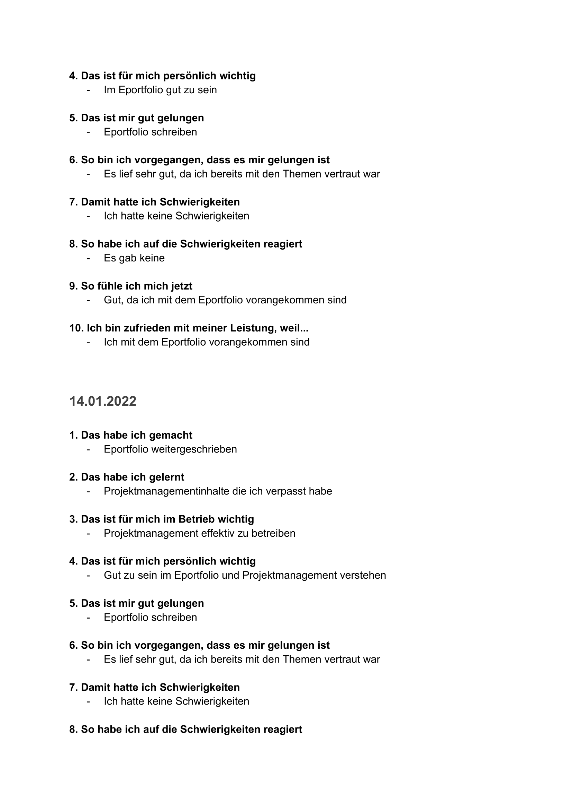
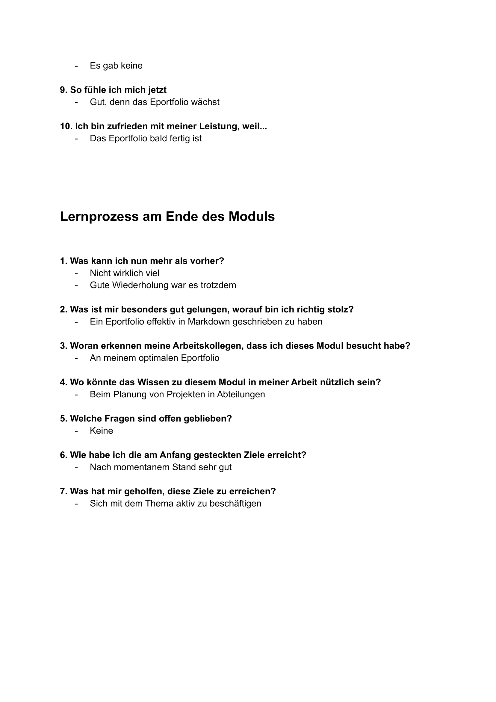

# ePortfolio

## Was ist ein ePortfolio
Ein **E-Portfolio** (_Elektronisches Portfolio_) ist die digitale Form eines Portfolios, das die neuen Medien zur Umsetzung dieses alten Konzeptes nutzt. Das E-Portfolio besteht aus „digitalen Sammelmappen“, mit denen Menschen (z. B. Studierende) ihren Lernprozess dokumentieren, reflektieren und/oder präsentieren können. Ein E-Portfolio impliziert damit ein Lerntagebuch. (Wikipedias offizielle Definition, 12.01.2022, https://de.wikipedia.org/wiki/E-Portfolio)

## Warum sollte ich ein ePortfolio erstellen
Ein ePortfolio ist eine sehr gute Möglichkeit um einen Überblick über den eigenen Fortschritt zu haben, da es für sich selbst oder teils auch anderen immer einsehbar ist.
Durch die stetige Editierbarkeit, ist es auch sehr einfach möglich eigene neu erworbenen Kenntnisse aufzunehmen und das Portfolio mit diesen zu erweitern.
Ein ePortfolio bietet einen Blick von außen auf die eigenen Erkenntnisse und Erfahrungen und lässt somit eine vereinfachte Verknüpfung zwischen Inhalten zu oder Zusammenhänge zwischen verschiedenen Inhalten und Kompetenzen zu erkennen.

## Wie erstelle ich Inhalte für ein ePortfolio
Ein ePortfolio wird mit den folgenden vier Schritten erstellt, diese auch in dieser Reihenfolge durchgangen werden sollten.
1. Es wird ein Inhalt gelernt, dies kann im Arbeitsumfeld, im persönlichen Umfeld oder durch weiterbildende Situationen erworben werden.
2. Als nächstes muss sich über das Thema informiert werden, dies geschieht meist mit dem Sammeln von zusätzlichen Materialien. Beispielsweise können hierfür seriöse Internetquellen, Literaturquellen oder Meinungen anderer Personen herangezogen werden. 
3. Im nächsten Schritt müssen diese noch ausgewertet werden und Erkentnisse aus diesen heruntergeschrieben werden.
4. Der finale Schritt ist dannach die gewonnen Erkentnisse im ePortfolio herunterzuschreiben und dadurch aufzubewahren.

**Sind verschiedene Lösungen relevant?**

## Was mache ich mit den gewonnen Informationen
Eine häufige Verwendung der gewonnenen Informationen ist eine Reflexion dieser Inhalt, es wird verglichen inwiefern diese Informationen früher geholfen hätten, helfen oder in Zukunft helfen können.

Beliebte Fragestellungen sind beispielsweise: 

 - Welche Probleme wurden durch diese neuen Erkenntnisse gelöst?
 - Hätten mir diese Informationen in der Vergangenheit geholfen? Wenn ja, bei was und zu welchen Problemen?
 - Gibt es alternative Informationen hierzu? Wenn ja, wie stehen diese im Zusammenhang?
 - Kann ich einen Bezug zu meinem Alltag oder Berufsalltag herauslesen?

Hier ist es auch sehr sinnvoll diese Errungenen Einsichten als Reflektion herunterzuschreiben.

## Unterschiede zwischen ePortfolio, Lernjournal und Datenablage
| ePortfolio | Lernjournal | Datenablage  |
| :-: | :-: | :-: |
| Inhaltlich gegliedert | Zeitlich gegeliedert | ungegliedert |
| Beinhaltet wichtiges | Beinhaltet wichtiges und unwichtiges     | Beinhaltet wichtiges und unwichtiges |
| Dokumentiert Inhalt | Dokumentiert Lernprozess |    Dokumentiert nicht |
| Reflexion der Inhalte | Reflexion des Lernens      |    Keine Reflexion |
| Querverbindungen möglich | Querverbindungen möglich      |    Keine Querverbindungen möglich |

Wie einfach zu erkennen ist, wird durch die obere Tabelle deutlich der Unterschied zwischen ePortfolio, Lernjournal und Datenablagen gezeigt, diese werden jedoch meistens leider als sehr ähnliche Konstrukte der Wissenerkennung oder Abspeicherung gesehen.
***
## Reflektion
Der Aufbau und Besitz eines ePortfolios ist eine sehr nützliche und vorallem sehr übersichtliche Art und Weise den eigenen Fortschritt zu messen und zu sehen wie man selbst gewachsen ist / was man selbst an Kompetenzen und Qualifikationen erworben hat.
In meinem Ausbildungsunternehmen (Hoffmann la Roche) wird uns auch ans Herz gelegt, dass wir unseren Lernfortschritt dokumentieren, auch wenn nur im Sinne eines Lernjournals.
Für mich persönlich ist jedoch ein ePortfolio (spätestens nach Besuch dieses Moduls) sehr essenziell und ich werde mir selbst auch ein ePortfolio im Sinne eines Webseiten Blogs aufbauen, um mir und anderen den Fortschritt in meiner Karriere in der Informatik aufzeigen zu können.  

## Lernjournal

 
